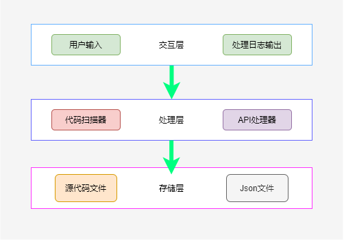

# 一、比赛相关

地址：https://www.oschina.net/2020-openeuler

## 1.题目名称

对主流语言(Python，Java，Go，PHP，JavaScript等选其一)开发的软件包依赖的API进行提取，与提供的API提取

<br>

## 2.题目难度

中

<br>

## 3.题目描述

操作系统与在操作系统上运行的软件之间，必然存在着兼容性的问题，而软件的接口API就是影响软件和操作系统之间兼容性的关键因素之一。如果能提取软件本身对外提供的API接口，或者外部调用该软件的API接口，对接口的分析结果就能对软件兼容性的判别起到极为关键的作用。

<br>

## 4.题目要求

### - 产出标准:

自行编写程序(Python优先)或者采用开源程序，对一种主流语言开发的软件包的API进行提取（例如Mysql主要是由C/C++开发，Ansible是由Python开发的，具体可以参考http://ic-openlabs.huawei.com/openlab/#/unioncompaty）

### - 技术要求:

对一门主流语言(Python，Java，Go，PHP，JavaScript等选其一)较为熟悉，有阅读和分析源码的能力，熟悉一门脚本语言(Python最好)，能上网搜索找到匹配的开源项目或相关论文作为参考和输入。


# 二、JavaAPI-Scanner

# 1.简单介绍
一个用于提取Java软件包 API信息的简单扫描器，本项目用FastJson软件包提取为例

<br>

## 2.架构图


<br>

## 3.项目结构
```mark
├── api-scanner # 项目源码
│   └── method_analsis_utils # 方法提取工具
│   	└── scanner # 扫描器：扫描源码中的方法 
│   	└── complier # 解析器：解析方法中内外部访问API
│   └── source # 源码、临时文件存放
│   	└── code # fastjson源码
│   	└── save # 编码过程中一些临时文件 
│   └── temp # 默认输出目录
│   └── main.py # 项目运行入口
│   └── method_analysis_job.py # 扫描器与编译器的封装任务文件
│   └── file_utils.py # 关于文件IO流的工具类
│   └── logging.conf # logging日志基本配置
│   └── method_testcase.py # 测试文件：测试scanner 和 complier
│   └── file_testcase.py # 测试文件：测试文件io流程相关
├── document	# 比赛项目文档、图片等静态文件存放处
│   └── 项目功能说明书.pdf # 项目功能说明书 pdf版
│   └── 【HTML版】方法文档 # pydoc生成的API文档
```

# 三、参考内容/感谢
[《自制编程语言》 - ［日］ 前桥和弥](https://book.douban.com/subject/25735333/)

[Compiler-zsthampi](https://github.com/zsthampi/Compiler)

